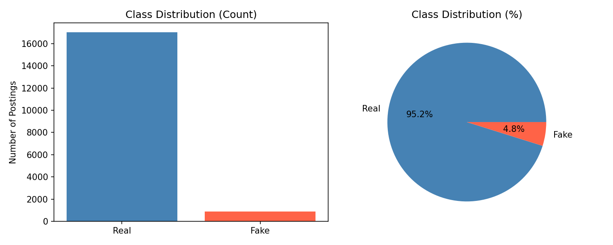
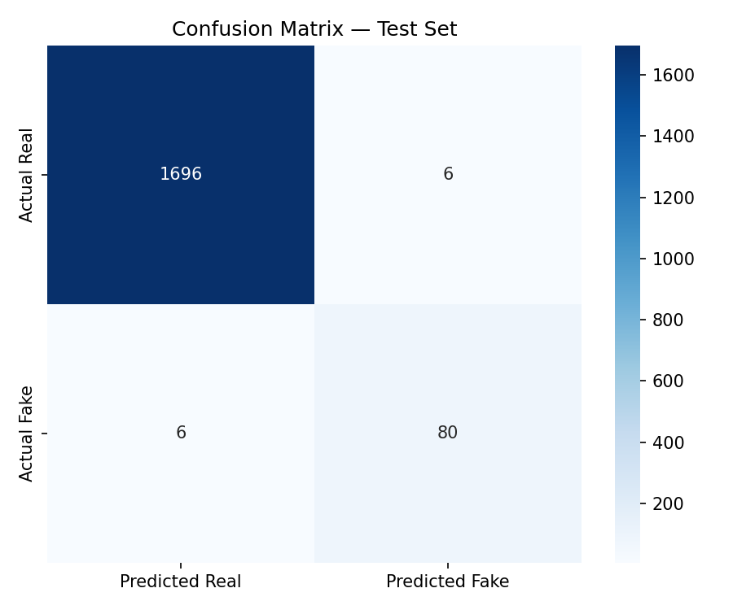
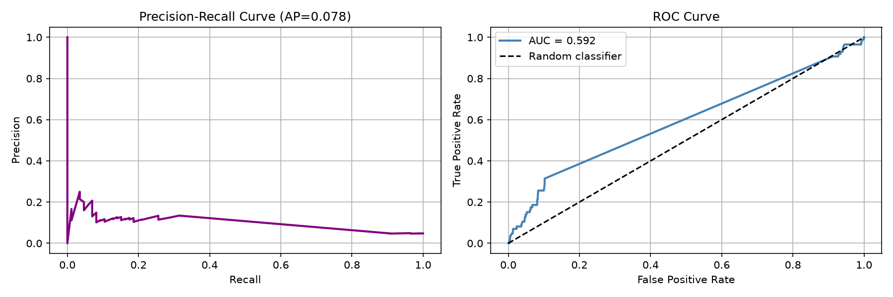
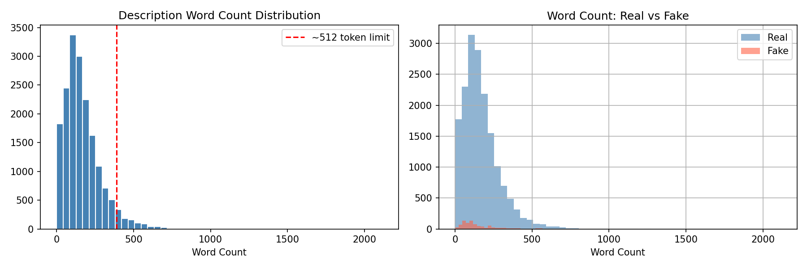
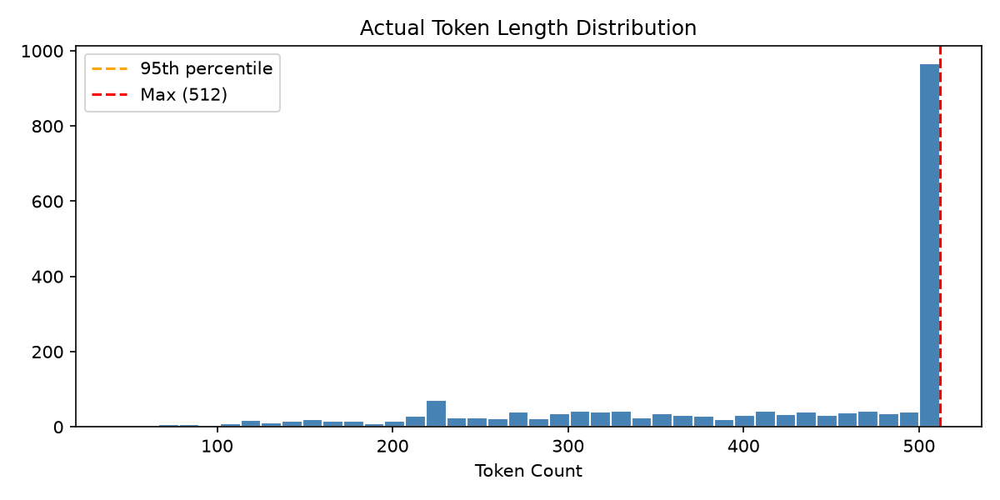

# Fake Job Postings Detection using DistilBERT

A binary text classifier that detects fraudulent job postings using fine-tuned DistilBERT, with weighted loss to handle class imbalance and full evaluation via TensorBoard.

---

## Results

| Metric | Value |
|--------|-------|
| Accuracy | 99% |
| Macro F1 | 0.96 |
| Fake Precision | 0.93 |
| Fake Recall | 0.93 |
| Fake F1 | 0.93 |
| AUC-ROC | 0.989 |
| Average Precision (PR) | 0.955 |

**Test set:** 1,788 samples — 1,702 real / 86 fake  
**False Negatives (fake jobs missed):** 6 out of 86  
**False Positives (real jobs flagged):** 6 out of 1,702

---

## Dataset

**Source:** [Kaggle — Real or Fake Job Posting Prediction](https://www.kaggle.com/datasets/shivamb/real-or-fake-fake-jobposting-prediction)

- 17,880 total job postings
- 17,014 real (95.2%) / 866 fake (4.8%) — heavily imbalanced
- Features used: title, company profile, description, requirements, benefits

### Class Distribution



---

## Model & Approach

### Why DistilBERT?
DistilBERT (Hugging Face) is a distilled, compressed version of Google's BERT. It is:
- **Bidirectional** — reads text left-to-right and right-to-left simultaneously, giving full context to every token
- **40% smaller** than BERT, **60% faster**, retaining 97% of BERT's language understanding
- Pre-trained on Wikipedia + BookCorpus — it already understands language deeply before we fine-tune it

### Fine-Tuning
We add a linear classification head on top of DistilBERT and train the full model on our task. This is **transfer learning** — we reuse DistilBERT's pre-trained language knowledge instead of learning from scratch.

### Key Design Decisions

**1. Multiple text fields combined**  
Rather than using only the job description, we concatenate: title + company profile + description + requirements + benefits. More signal = better detection.

**2. Weighted cross-entropy loss for class imbalance**  
With 95.2% real / 4.8% fake, a naive model predicting "real" for everything achieves 95% accuracy but catches zero fraud. We compute per-class weights so fake job mistakes are penalised ~19.6x more than real job mistakes, forcing the model to actually learn the minority class.

```
weight_for_class_i = total_samples / (n_classes × samples_in_class_i)
→ Weight Real: 0.525 | Weight Fake: 10.320
```

**3. Stratified train/val/test split**  
With only ~866 fake examples, a random split risks too few fakes in validation. Stratified splitting preserves the class ratio across all three splits (train: 4.8%, val: 4.9%, test: 4.8%).

**4. Linear LR warmup + decay**  
Standard for transformer fine-tuning. The first 10% of training steps (268 of 2,682) linearly increase the LR from 0 to peak (2e-5), then decay. Prevents large early gradient updates from destabilising pre-trained weights.

**5. Best model saved on macro F1, not accuracy**  
Accuracy is misleading for imbalanced data. The checkpoint is saved whenever validation macro F1 improves.

---

## Evaluation

### Confusion Matrix



| | Predicted Real | Predicted Fake |
|---|---|---|
| **Actual Real** | 1696 ✓ | 6 ✗ |
| **Actual Fake** | 6 ✗ | 80 ✓ |

### Precision-Recall & ROC Curves



- **AP = 0.955** — the model maintains high precision across almost all recall levels
- **AUC = 0.989** — strong overall discriminative ability

### Text Length Analysis




Most descriptions fall within DistilBERT's 512-token limit. Combined fields (title + profile + description + requirements + benefits) do frequently hit the limit, which is handled via truncation.

---

## Project Structure

```
fake_job_detection/
├── data/
│   └── fake_job_postings.csv        ← download from Kaggle (see Setup)
├── models/
│   ├── tokenizer/                   ← created by notebook 2
│   └── best_model/                  ← best checkpoint saved during training
├── notebooks/
│   ├── 01_EDA.ipynb                 ← data exploration and preprocessing
│   ├── 02_Tokenization.ipynb        ← tokenization walkthrough
│   ├── 03_Training.ipynb            ← fine-tuning DistilBERT
│   └── 04_Evaluation.ipynb          ← metrics, confusion matrix, PR/ROC curves
├── tensorboard_logs/                ← training logs
├── setup.py                         ← installs all dependencies automatically
└── README.md
```

---

## Setup & Usage

### Prerequisites
- Python 3.10+
- NVIDIA GPU recommended (RTX 3060 or better). CPU training is possible but takes many hours.

### Step 1 — Get the dataset
Download `fake_job_postings.csv` from [Kaggle](https://www.kaggle.com/datasets/shivamb/real-or-fake-fake-jobposting-prediction) and place it in the `data/` folder.

### Step 2 — Install dependencies
```bash
python setup.py
```
This installs all packages including CUDA-enabled PyTorch and verifies your GPU.

### Step 3 — Run notebooks in order

| Notebook | What it does | Output |
|----------|-------------|--------|
| `01_EDA.ipynb` | EDA, class analysis, text preprocessing | `data/processed.csv` |
| `02_Tokenization.ipynb` | Tokenization walkthrough | `models/tokenizer/` |
| `03_Training.ipynb` | Fine-tunes DistilBERT (3 epochs) | `models/best_model/` |
| `04_Evaluation.ipynb` | Full evaluation on test set | Plots + metrics |

### Step 4 — View TensorBoard
```bash
tensorboard --logdir tensorboard_logs
# Open http://localhost:6006
```

---

## Training Configuration

| Parameter | Value |
|-----------|-------|
| Model | distilbert-base-uncased |
| Max token length | 256 |
| Batch size | 16 |
| Epochs | 3 |
| Learning rate | 2e-5 |
| LR warmup | 10% of steps |
| Optimizer | AdamW (weight_decay=0.01) |
| Loss | Weighted Cross-Entropy |
| Seed | 42 |
| Training samples | 14,304 |

---

## Tech Stack

- Python 3.10
- PyTorch 2.1
- Hugging Face Transformers (DistilBERT)
- scikit-learn
- TensorBoard
- pandas, numpy, matplotlib, seaborn